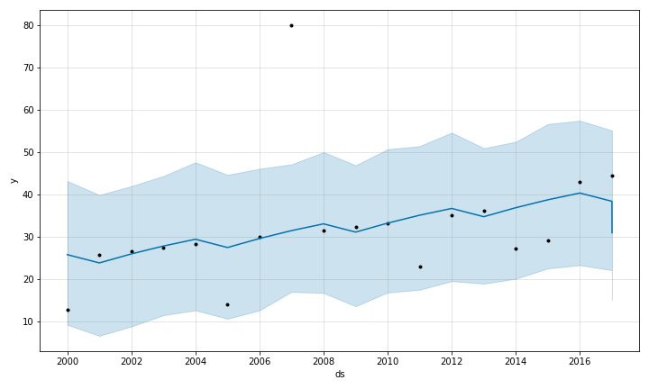

# SATurn: A Structured Analytical Techniques EDA tool
The goal of this project is to provide users with exploratory data analysis (EDA) tools that enhance factor selection for structured analytic technique (SAT) analyses.

## Contents
1. [Motivation](#motivation)
2. [Structured Analytic Techniques Background](#structured-analytic-techniques-background)
3. [SATurn Overview](#saturn-overview)
4. [Installation](#installation)
5. [Quick Start](#quick-start)

## Motivation:
The motivation behind this project was our experience with building historical analogs for the World Modelers Program. In that effort we explored the utility of using explanatory factors (such as rainfall, temperature, and storm history) to predict the change in crop production following a locust infestation. In the process it was clear that choosing factors with any predictive power required a method to better select possible factor candidates. This led to SATurn, which provides analytic tools for exploratory data analysis (EDA) to better understand and "see" the data in the World Modeler's Datamarts.

## Structured Analytic Techniques Background:
Below is an excerpt from [RAND: Assessing the Value of Structured Analytic Techniques in the U.S. Intelligence Community](https://www.rand.org/content/dam/rand/pubs/research_reports/RR1400/RR1408/RAND_RR1408.pdf) discussing SATs:

`What Are Structured Analytic Techniques, and Why Do Analysts Use Them?

SATs are methods of organizing and stimulating thinking...These methods aim to make the analytic process conscious and transparent, thus reducing the probability of errors caused by numerous cognitive biases that go unchallenged in unstructured and intuitive analysis. According to an unclassified U.S. government guide to analytic tradecraft, SATs fall into three broad categories: 
1. Diagnostic techniques aim to make assumptions and logical arguments more transparent;
2. Contrarian techniques challenge current thinking; and 
3. Imaginative thinking techniques encourage new perspectives, insights, and alternative scenarios.

Among the many SATs in use today, the most common are:
• Structured brainstorming—a group discussion process used for generating new ideas and concepts often used to kick off analysis of especially complex or controversial issues
• Key assumptions check—a systematic effort to make explicit and question the assumptions that guide an analyst’s interpretation of evidence and reasoning about any particular problem 
• Analysis of competing hypotheses (ACH)—the identification of a complete set of alternative hypotheses, the systematic evaluation of each through the examination of evidence and data that applies to them all, and the selection of the most explanatory or best-fitting hypothesis (or hypotheses) by focusing on information that tends to disconfirm weaker hypotheses
• Indicators—a pre-established set of observable phenomena that are periodically reviewed to help track events, spot emerging trends, and warn of unanticipated changes

SATurn is a tool to support _Indicators_ SAT by providing a method to streamline the indicator selection process. 

## SATurn Overview
What is it?
SATurn is an API built with openapi that provides methods to search, download, visualize, forecast, and correlate data based on user-selected keyword, geospatial, and temporal filters.

What does it do?
SATurn provides the tools listed below to enable EDA directly with World Modeler's data:
1. Correlation: Return the Pearson's Correlation Coefficient for user selected variables and country
2. Time Series: Utilize [Prophet](https://github.com/facebook/prophet) to fit and forecast time series data from selected ISI variable_ids
3. Download: Download datasets from ISI
4. Search: Search the ISI Datamart for data of interest
5. Visualization: Plot time series data for selected countries and variable id from the ISI Datamart
6. Clustering: TBD

For a detailed explanation of tool implementation, see the [Usage](#usage) section below

What data is available?
Any registered dataset in the World Modeler's ISI Datamart.  Broadly, the ISI Datamart stores related data in a dataset and registers variable data within the dataset. SATurn allows the user to search for and retrieve relevant datasets and variables and employ the EDA techniques ons the selected data.

## Installation
Below are instructions for installing SATurn from a terminal window.

1. Clone the [SATurn](https://github.com/jataware/SATurn) repository to `your/local/folder`.
2. Run `cd your/local/folder/api && pip install -r requirements.txt`
3. Run `python3 -m pip install swagger_ui_bundle`

## Quick Start

Below are instructions for running a local version of the SATurn API:

1.  Run `cd your/local/folder/api`
2. Open the `config.ini` and update the file with the ISI Datamart credentials. You can e-mail me at travis@jataware.com if you do not have the credentials.
3. Run `python3 -m openapi_server`
4. Open your browser and go to: `http://0.0.0.0:8080/ui/`

## Usage

Below describes how to use each endpoint.
1. `/search`: Search the ISI Datamart via keywords and countries to identify possible variables of interest.
```
curl -X POST "http://0.0.0.0:8080/search" -H  "accept: application/json" -H  "Content-Type: application/json" -d "{\"area_name\":[\"Ethiopia\",\"Kenya\",\"Argentina\"],\"keywords\":[\"wfp\",\"world food prices\"]}"
```
  - `area_name`: Optional item. Enter n number of countries in a list to filter search results.
  - `keywords`: Required item. Enter n number of keywords in a list to search for; this is an `OR` search meaning results are the union of all the keyword searches.

2. `/download`: Download the selected variables for inspection. From the `/search` endpoint, take note of the `dataset_ids` and `variable_ids` of interest.
 
 ```
curl -X POST "http://0.0.0.0:8080/download_variables/WDI" -H  "accept: text/csv" -H  "Content-Type: application/json" -d "[\"access_to_electricity_of_population\",\"access_to_clean_fuels_and_technologies_for_cooking_of_population\"]"
```
  - `dataset_id`: Required item. An inline parameter for the download url posted to the ISI Datamart.
  - variables: Required item. Enter n number of variable_ids in a list for a single `dataset_id`.

3. `/correlation`: For a chosen country or variable, return the Pearson's Correlation Coefficient for selected data:
```
curl -X POST "http://0.0.0.0:8080/correlation" -H  "accept: text/csv" -H  "Content-Type: application/json" -d "{\"correlators\":[\"single_country\"],\"country\":[\"Ethiopia\"],\"ids\":{\"id1\":{\"dataset_id\":\"WDI\",\"variable_id\":\"access_to_electricity_of_population\"},\"id2\":{\"dataset_id\":\"WDI\",\"variable_id\":\"access_to_clean_fuels_and_technologies_for_cooking_of_population\"}},\"time\":{\"end\":\"2020-01-01\",\"start\":\"1990-01-01\"}}"
```
- `correlators`: Required item. Enter either:
    - `single_country`: Correlate n variable_ids for a single country 
    - `single_variable`: Correlate n countries for a single variable id
- `country`: Required item. If you chose `single_variable`, enter n number of countries in a list. If you chose `single_country`, enter only one country in a list.
-   `ids`: Required item.  
    - If you chose `single_variable`, enter only `id1` with a single `dataset_id` and single `variable_id`. 
    - If you chose `single_country`, enter `id1` and `id2` with the associated `dataset_id` and `variable_id` you are interested in correlating.
- `time`: Optional item. Temporal filter of your data.
  - `start`: Required item. Either "None" or the no earlier than date in ISO8601 format of YYYY-MM-DD.
  - `end`: Required item. Either "None" or the no later than date in ISO8601 format of YYYY-MM-DD.

4. `/timeseries`: Return a csv with time series fit and forecast for selected variable_id with temporal and geospatial filters. In the curl request below, with the time series data from the WDI dataset and "access_to_electricity_of_population" variable, as well as a time filter from 1990 to 2020, this endpoint returns a csv file with a time series fit and forecast. The API does not have plotting functionality, but the csv data can be copied and plotted using your software of choice.  Below is the fitted/forecasted plot:



```
curl -X POST "http://0.0.0.0:8080/timeseries" -H  "accept: text/csv" -H  "Content-Type: application/json" -d "{\"country\":[\"Ethiopia\"],\"ids\":{\"id1\":{\"dataset_id\":\"WDI\",\"variable_id\":\"access_to_electricity_of_population\"}},\"time\":{\"end\":\"2020-01-01\",\"start\":\"1990-01-01\"}}"
```
  -`country`: Optional item. Enter n number of countries in a list
  -`dataset_id`: Required item. Enter dataset_id of variable of interest
  -`variable_id`: Required item. Enter single variable id of time series data that you would like to fit and forecast with the [Facebook Prophet](https://facebook.github.io/prophet/docs/quick_start.html#python-api) module. 
- `time`: Optional item. Temporal filter of your data.
  - `start`: Required item. Either "None" or the no earlier than date in ISO8601 format of YYYY-MM-DD.
  - `end`: Required item. Either "None" or the no later than date in ISO8601 format of YYYY-MM-DD.


5. `/visualization`: TBD

## Correlation Example
Below is an end-to-end use-case example for implementing the correlation functionality of SATurn:

Use-Case: The user is interested in calculating the Pearson's Correlation Coefficient for two variables:
	- TBD


## Development
OpenAPI allows for flexible code generation should you wish to expand SATurn and develop your own EDA tool. A new endpoint can be added to the `openapi.yaml` file.  Below are the steps needed:

1. Go to and save [openapi-generator-cli-3.0.0.jar](https://github.com/jataware/SATurn/blob/main/codegen/openapi-generator-cli-3.0.0.jar) to `your/local/folder/`
2. Open the `your/local/folder/api/openapi_server/openapi/openapi.yaml` file.
3. Add your desired endpoint(s) and define your new schema.
4. Save your new `openapi.yaml` file to `your/local/folder/`
5. Run `cd your/local/folder/`
6. Rename your existing `api` folder to anything you'd like (...such as `api_old`)
8. Run `java -jar openapi-generator-cli-3.0.0.jar generate -i openapi.yaml -l python-flask -o api`. This will generate a new flask app under the `api` folder with your updated endpoint(s).
9. The python functions and api controllers do not transfer over when building a new flask-app. You will need to copy and paste all functions and controller code from the `api_old`folder into your new `api` folder at the same file locations as in  `old_api`. 

    Specifically, copy the files below from `~/api_old/` to `~api/`:
    
	- `correlations.py`
	- `isi_functions.py`
	- `timeseries_func.py`
	- `visualize_func.py`
	- `config.ini`

   Copy the files below from `~/api_old/openapi_server` to `~api/openapi_server`:
 
   - `__main__.py`
    - `util.py`
    
    And finally, copy the controller files  below from `~/api_old/openapi_server/controllers/` to `~api/openapi_server/controllers`:
    - `clustering_controller.py`
    - `correlation_controller.py`
    - `download_controller.py`
    - `search_controller.py`
    - `time_series_controller.py`
    - `visualization_controller.py`

Work in progress, challenges
